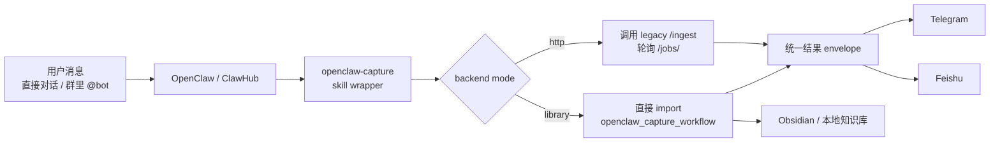
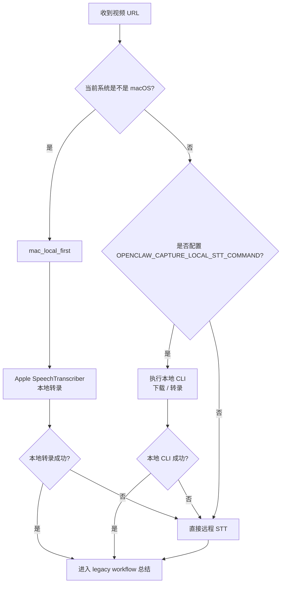
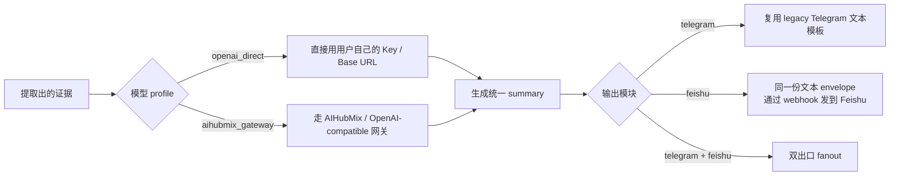

# OpenClaw Capture Skill

`openclaw-capture-skill` 是一个给 OpenClaw / ClawHub 用的“外包裹 skill 项目”。

它不重写 [openclaw_capture_workflow](/Users/boyuewu/Documents/Projects/AIProjects/openclaw_capture_workflow) 的核心处理能力，而是把那个已经跑通的本地工作流包装成一个更容易安装、切换链路、切换模型入口、切换消息出口的 skill。

一句话理解：

> 旧项目继续负责真正的内容理解与落库，新项目负责把它变成一个可安装、可路由、可多出口的 OpenClaw skill。

## 1. 这个项目解决什么问题

现有 [openclaw_capture_workflow](/Users/boyuewu/Documents/Projects/AIProjects/openclaw_capture_workflow) 已经能处理：

- 链接
- 纯文本
- 图片 / OCR
- 视频 URL
- Obsidian 写入
- Telegram 回执

但它本身更像一个“本地后端工程”，还不是一个完整的、可复用的 skill 分发项目。主要问题有：

- 安装路径仍偏旧：原仓库脚本写到 `~/.openclaw/skills/`
- 入口协议和通知实现明显偏 Telegram
- 非 macOS 场景下的转录链路切换不够清晰
- 直接模型 Key 与 AIHubMix 网关接入还没有被统一包装成 profile
- 缺少一个给使用者看的项目级说明书

这个 sibling project 的目标就是把这些部分补齐，同时不改动旧仓库。

## 2. 设计原则

### 不动旧仓库

新的 [openclaw-capture-skill](/Users/boyuewu/Documents/Projects/AIProjects/openclaw-capture-skill) 与旧的 [openclaw_capture_workflow](/Users/boyuewu/Documents/Projects/AIProjects/openclaw_capture_workflow) 平行存在。

- 旧仓库继续作为真实处理内核
- 新仓库负责 skill 包装、路由、安装和多出口 fanout

这样做的好处是：

- 不破坏你现在已经跑通的效果
- skill 项目可以单独演进
- 后续要换 backend mode、加飞书、改安装方式都不必动旧工程

### skill 包保持精简

真正会被 OpenClaw 读取的 skill 包在 [openclaw-capture](/Users/boyuewu/Documents/Projects/AIProjects/openclaw-capture-skill/openclaw-capture) 目录下，只保留：

- [SKILL.md](/Users/boyuewu/Documents/Projects/AIProjects/openclaw-capture-skill/openclaw-capture/SKILL.md)
- [agents/openai.yaml](/Users/boyuewu/Documents/Projects/AIProjects/openclaw-capture-skill/openclaw-capture/agents/openai.yaml)
- `references/`
- `scripts/`

项目级的详细介绍、实现说明和验证结果则放在这个 [README.md](/Users/boyuewu/Documents/Projects/AIProjects/openclaw-capture-skill/README.md)，避免把 skill 本体写得过重。

## 3. 架构总览

```text
OpenClaw / ClawHub
        |
        v
openclaw-capture (skill)
        |
        v
dispatch_capture.py
        |
        +--> library mode  --> import openclaw_capture_workflow directly
        |
        +--> http mode     --> call legacy /ingest + /jobs/<id>
        |
        v
shared result envelope
        |
        +--> telegram
        +--> feishu
```

关键实现文件：

- 调度入口：[cli.py](/Users/boyuewu/Documents/Projects/AIProjects/openclaw-capture-skill/openclaw-capture/scripts/runtime/openclaw_capture_skill/cli.py)
- 后端封装：[dispatcher.py](/Users/boyuewu/Documents/Projects/AIProjects/openclaw-capture-skill/openclaw-capture/scripts/runtime/openclaw_capture_skill/dispatcher.py)
- 配置读取：[config.py](/Users/boyuewu/Documents/Projects/AIProjects/openclaw-capture-skill/openclaw-capture/scripts/runtime/openclaw_capture_skill/config.py)
- profile 路由：[profiles.py](/Users/boyuewu/Documents/Projects/AIProjects/openclaw-capture-skill/openclaw-capture/scripts/runtime/openclaw_capture_skill/profiles.py)
- 输出扇出：[notifiers.py](/Users/boyuewu/Documents/Projects/AIProjects/openclaw-capture-skill/openclaw-capture/scripts/runtime/openclaw_capture_skill/notifiers.py)
- STT 桥接：[video_audio_bridge.py](/Users/boyuewu/Documents/Projects/AIProjects/openclaw-capture-skill/openclaw-capture/scripts/runtime/openclaw_capture_skill/video_audio_bridge.py)

### 3.1 GitHub 演示版总流程图

这个图适合放在 GitHub README 顶部，也适合录视频时先讲“系统边界”：



### 3.2 平台路由图

这个图适合你在视频里讲“Mac 和非 Mac 为什么不是一条链路”：



### 3.3 模型与出口路由图

这个图适合你讲“输入进来之后，模型接入和消息出口是怎么切开的”：



### 3.4 录视频时可以怎么讲

推荐的讲解顺序：

1. 入口消息进入 OpenClaw / ClawHub。
2. `openclaw-capture` wrapper 负责 backend mode、STT、模型 profile、输出 fanout。
3. `library` 模式直接 import `openclaw_capture_workflow`。
4. `http` 模式兼容 legacy `/ingest`。
5. 视频链路按平台分流：Mac 优先 Apple 本地转录，非 Mac 优先本地 CLI，再回退远程 STT。
6. 最终统一 summary 可以发送到 Telegram、Feishu 或双出口。

## 4. 支持的模块与策略

### 核心 wrapper

核心 wrapper 永远存在，负责：

- 接受 legacy payload
- 选择 `library` 或 `http` backend
- 构建共享结果 envelope
- 决定是否扇出到 Telegram / Feishu

### `mac-local`

当系统是 macOS 且没有显式覆盖时，默认选择 `mac_local_first`：

- 优先复用旧仓库的 Apple `SpeechTranscriber` 链路
- 失败时回落到旧仓库已有的远程 STT

### `cloud-stt`

非 macOS 默认走云 / 本地 CLI 混合策略：

- 如果设置了 `OPENCLAW_CAPTURE_LOCAL_STT_COMMAND`，先试本地 CLI
- 本地失败则回退到旧仓库远程 STT
- 如果没配本地 CLI，直接走远程

### `telegram`

Telegram 输出不是重新发明一套格式，而是直接复用旧仓库的 Telegram 文本组装逻辑，因此 Telegram 和 Feishu 可以共享同一份摘要文本。

### `feishu`

Feishu 当前使用 webhook 文本消息：

- 复用 Telegram 生成的共享文本 envelope
- 不额外设计第二套 summary schema

## 5. 两种 backend mode

### `library`

这是默认推荐模式。

行为：

- 直接 import [openclaw_capture_workflow](/Users/boyuewu/Documents/Projects/AIProjects/openclaw_capture_workflow)
- 在 wrapper 进程里调用提取、总结、写笔记逻辑
- wrapper 接管通知 fanout

优点：

- 不依赖旧服务单独启动
- 更容易接入 Feishu
- 更适合后续扩展

### `http`

兼容模式。

行为：

- 调 legacy `/ingest`
- 轮询 `/jobs/<id>`
- 本地补 Feishu fanout
- Telegram 视为 legacy 自己发送，wrapper 避免重复发送

适合场景：

- 旧服务已经在跑
- 想先复用原来的服务进程

详细版本见 [docs/ARCHITECTURE.md](docs/ARCHITECTURE.md)。

## 6. 配置接口

主要环境变量：

- `OPENCLAW_CAPTURE_LEGACY_PROJECT_ROOT`
- `OPENCLAW_CAPTURE_BACKEND_MODE=library|http`
- `OPENCLAW_CAPTURE_BACKEND_URL`
- `OPENCLAW_CAPTURE_STT_PROFILE=mac_local_first|local_cli_then_remote|remote_only`
- `OPENCLAW_CAPTURE_LOCAL_STT_COMMAND`
- `OPENCLAW_CAPTURE_MODEL_PROFILE=openai_direct|aihubmix_gateway`
- `OPENCLAW_CAPTURE_MODEL_API_BASE_URL`
- `OPENCLAW_CAPTURE_MODEL_API_KEY`
- `OPENCLAW_CAPTURE_MODEL_NAME`
- `OPENCLAW_CAPTURE_OUTPUTS=telegram,feishu`
- `OPENCLAW_CAPTURE_TELEGRAM_BOT_TOKEN`
- `OPENCLAW_CAPTURE_FEISHU_WEBHOOK`
- `OPENCLAW_CAPTURE_VAULT_PATH`

profile 的默认策略已经内置在 [profiles.py](/Users/boyuewu/Documents/Projects/AIProjects/openclaw-capture-skill/openclaw-capture/scripts/runtime/openclaw_capture_skill/profiles.py)。

## 7. 安装方式

安装脚本：

- [scripts/install_skill.sh](/Users/boyuewu/Documents/Projects/AIProjects/openclaw-capture-skill/scripts/install_skill.sh)

执行后会安装到：

```text
~/.openclaw/workspace/skills/openclaw-capture
```

这已经和旧仓库的 `~/.openclaw/skills/...` 路径区分开了。

## 8. 启动监听服务

复制仓库或安装 skill 之后，如果需要本地直接提供 `/ingest` 监听，必须显式启动 wrapper 服务：

```bash
cd /Users/boyuewu/Documents/Projects/AIProjects/openclaw-capture-skill/openclaw-capture

OPENCLAW_CAPTURE_LEGACY_PROJECT_ROOT=/Users/boyuewu/Documents/Projects/AIProjects/openclaw_capture_workflow \
OPENCLAW_CAPTURE_BACKEND_MODE=library \
python3 scripts/dispatch_capture.py serve --host 127.0.0.1 --port 8765
```

健康检查：

```bash
curl http://127.0.0.1:8765/health
```

成功时应返回：

```json
{"ok": true}
```

## 9. 使用示例

### 示例 1：从源码目录直接调用

```bash
cd /Users/boyuewu/Documents/Projects/AIProjects/openclaw-capture-skill/openclaw-capture

OPENCLAW_CAPTURE_LEGACY_PROJECT_ROOT=/Users/boyuewu/Documents/Projects/AIProjects/openclaw_capture_workflow \
OPENCLAW_CAPTURE_OUTPUTS= \
python3 scripts/dispatch_capture.py <<'JSON'
{
  "chat_id": "-1001",
  "request_id": "demo-local-dry-run",
  "source_kind": "pasted_text",
  "raw_text": "OpenClaw Capture Skill 用于把内容送进本地工作流，并根据系统与配置切换 STT 和通知出口。",
  "image_refs": [],
  "requested_output_lang": "zh-CN",
  "dry_run": true
}
JSON
```

### 示例 2：安装后调用

```bash
cd ~/.openclaw/workspace/skills/openclaw-capture

OPENCLAW_CAPTURE_LEGACY_PROJECT_ROOT=/Users/boyuewu/Documents/Projects/AIProjects/openclaw_capture_workflow \
OPENCLAW_CAPTURE_OUTPUTS= \
python3 scripts/dispatch_capture.py <<'JSON'
{
  "chat_id": "-1001",
  "request_id": "demo-installed-dry-run",
  "source_kind": "pasted_text",
  "raw_text": "安装后的 OpenClaw Capture Skill 通过 wrapper 复用旧工作流。",
  "image_refs": [],
  "requested_output_lang": "zh-CN",
  "dry_run": true
}
JSON
```

## 10. 已完成的验证

### 自动化测试

我已经跑过：

```bash
python3 -m unittest discover -s tests
```

结果：

- `10` 个测试全部通过

覆盖范围包括：

- STT profile 选择
- 模型 provider profile 选择
- Telegram + Feishu fanout
- `library` 模式集成
- `http` 模式集成
- 安装路径验证

### 实际可用性修正

为了让它在“没有模型 key”的环境里也能做真实 dry-run，我额外补了一个本地 deterministic note renderer：

- [fallback_renderer.py](/Users/boyuewu/Documents/Projects/AIProjects/openclaw-capture-skill/openclaw-capture/scripts/runtime/openclaw_capture_skill/fallback_renderer.py)

同时，wrapper 现在会把 `dry_run` 固定切到本地稳定摘要路径，而不是沿用旧仓库里容易被结构校验拒掉的 fallback：

- [local_summary.py](/Users/boyuewu/Documents/Projects/AIProjects/openclaw-capture-skill/openclaw-capture/scripts/runtime/openclaw_capture_skill/local_summary.py)

这样即使没有可用模型 key，安装后的 skill 仍能产出可读的预览内容，而不是只返回 `note renderer unavailable` 或被旧 fallback summary 拒掉。

## 11. 当前边界与限制

- Feishu 目前走 webhook 文本消息，还不是更复杂的卡片格式
- `http` 模式下 Telegram 仍默认交给 legacy 服务，以避免重复回执
- 非 OpenAI-compatible 的原生网关不在 v1 范围内
- 旧 payload 仍保留 `chat_id` / `reply_to_message_id` 这种 Telegram 风格字段，v1 没有把协议彻底去 Telegram 化

## 12. 这个 skill 现在是否真的可用

结论：可以用。

更准确地说，它已经满足“可安装、可调用、可复用旧工作流、可做 dry-run、本地可验证”的标准：

- 能安装到标准路径
- 能从安装后的 skill 目录执行
- 能在 `library` 模式直接包裹旧仓库
- 能在 `http` 模式兼容旧服务
- 能在没有模型 key 的情况下给出本地 dry-run 结果

当前仓库已经具备 GitHub 仓库、ClawHub 发布和本地 HTTP 监听三种可用形态。
