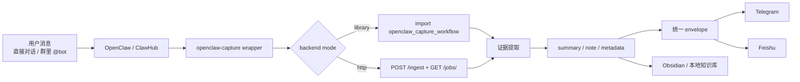
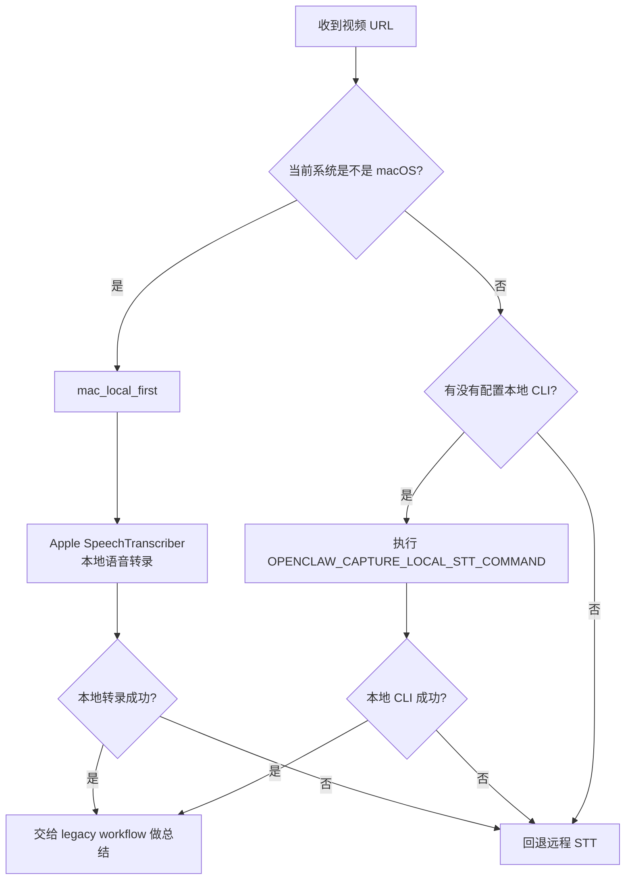
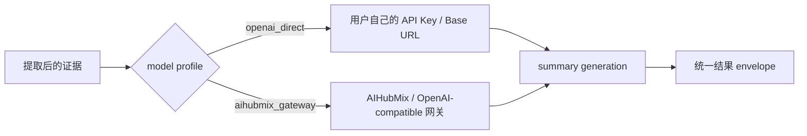
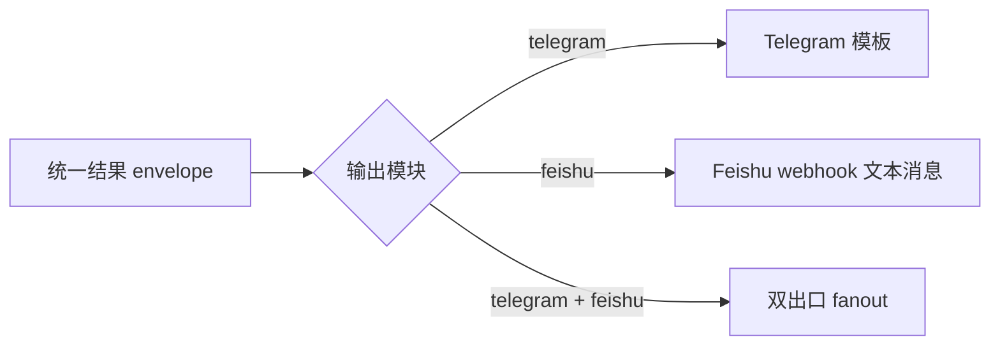

# OpenClaw Capture Skill Architecture

这份文档用于说明 wrapper 的边界、路由逻辑和平台分流。

## 1. 系统边界

`openclaw-capture-skill` 不是新的内容处理引擎，而是现有 `openclaw_capture_workflow` 的 skill 外包裹层。

职责分工：

- `openclaw_capture_workflow`
  - 真正做提取、总结、写笔记
  - 已经有稳定的本地链路
- `openclaw-capture-skill`
  - 接住 OpenClaw / ClawHub 入口
  - 路由 backend mode
  - 决定 STT 策略
  - 决定模型接入 profile
  - 决定 Telegram / Feishu fanout

## 2. 端到端总流程



## 3. Backend Mode

### `library`

推荐模式。

特点：

- 不依赖单独启动 legacy HTTP 服务
- 直接复用旧仓库 Python package
- wrapper 自己接管输出扇出

适合：

- 本机部署
- 想快速验证
- 想更容易扩展 Feishu 或其他出口

### `http`

兼容模式。

特点：

- 继续用旧的 `/ingest`
- wrapper 只负责调用和补充 fanout
- 更接近历史系统

适合：

- 旧服务已经在跑
- 你不想调整现有服务进程

## 4. 视频转录平台分流



## 5. 模型接入路由



### `openai_direct`

- 适合用户自己直接提供模型 Key
- 可以直连 OpenAI-compatible 接口

### `aihubmix_gateway`

- 适合统一走 AIHubMix 一类网关
- 仍按 OpenAI-compatible 方式请求

## 6. 输出 fanout



这里的关键点不是“两个出口各写一套总结”，而是：

- 先产出一份统一 summary
- Telegram 复用 legacy 的文本组织方式
- Feishu 直接消费同一份 envelope

这样做的好处是：

- 输出一致
- fanout 逻辑简单
- 新增出口时更容易扩展

## 7. 代码映射

如果别人看完图还想追代码，核心入口可以看这些文件：

- `openclaw-capture/scripts/runtime/openclaw_capture_skill/dispatcher.py`
- `openclaw-capture/scripts/runtime/openclaw_capture_skill/video_audio_bridge.py`
- `openclaw-capture/scripts/runtime/openclaw_capture_skill/profiles.py`
- `openclaw-capture/scripts/runtime/openclaw_capture_skill/notifiers.py`
- `openclaw-capture/scripts/runtime/openclaw_capture_skill/config.py`

## 8. 本地监听模式

如果需要让这个 wrapper 自己监听 `/ingest`，可以直接运行：

```bash
OPENCLAW_CAPTURE_LEGACY_PROJECT_ROOT=/path/to/openclaw_capture_workflow \
OPENCLAW_CAPTURE_BACKEND_MODE=library \
python3 openclaw-capture/scripts/dispatch_capture.py serve --host 127.0.0.1 --port 8765
```

这样复制仓库之后，不需要单独依赖旧服务先启动，wrapper 自己就会提供：

- `GET /health`
- `POST /ingest`
- `GET /jobs/<id>`
